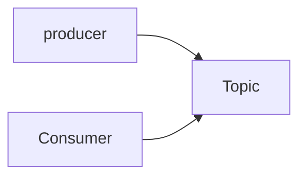

# coupon-system
[Redis/Kafka] 실습으로 배우는 선착순 이벤트 시스템


## 1. 요구사항 정의
선착순 100명에게 할인쿠폰을 제공하는 이벤트를 진행하고자 한다.

이 이벤트는 아래와 같은 조건을 만족하여야 한다.
- 선착순 100명에게만 지급되어야한다.
- 101개 이상이 지급되면 안된다.
- 순간적으로 몰리는 트래픽을 버틸 수 있어야 합니다.


### 환경세팅
- docker 설치
```angular2html
brew install docker
brew link docker

docker version
```

- docker mysql 실행 명령어

```
docker pull mysql
docker run -d -p 3306:3306 -e MYSQL_ROOT_PASSWORD=1234 --name mysql mysql
docker ps
docker exec -it mysql bash
```

- mysql 명령어

```
mysql -u root -p
create dabase coupon_example;
use coupon_example;
```

- 쿠폰 발급 로직을 작성

```java
	public void apply(Long userId) {
		Long count = couponCountRepository.increment();

		if (count > 100) {
			return;
		}
		couponCreateProducer.create(userId);
	}
```


## 2. 쿠폰 발급의 문제점
- 쿠폰이 100개 생성될 것을 기대했지만 실제로는 100개 이상이 생성됨

### race condition 
- 2 개 이상의 쓰레드가 공유 데이터에 엑세스하고 작업하려고 할 때 발생하는 문제

### 예상 동작

|Thread-1|Coupon count|Thread-2|
|--|--|--|
|select count(*) from coupon|99| |
|create coupon|100| |
| | 100 | select count(*) from coupon|
| | 100 | failed create coupon|

### 실제 동작

|Thread-1|Coupon count|Thread-2|
|--|--|--|
|select count(*) from coupon | 99 | |
| | 99 | select count(*) from coupon |
| create coupon | 100 | |
| | 101 | create coupon |


## 3. Redis를 활용하여 문제 해결하기


```text
docker pull redis
docker run --name myredis -d -p 6379:6379 redis
```

|시간| Thread-1     | Redis-count count  | Thread-2                                                |
|--|--------------|--------------------|---------------------------------------------------------|
|10:00| start- 10:00 | 99 |                                                         |
|10:01| incr coupon_count | 99 | wait...                                                 |
|10:02| end - 10:02 | 100 | wait...                                                 |
|10:03| create coupon| 101 | start - 10:02 <br/> incr coupon_count <br/> end - 10:03 |
| | | 101 | failed create counpon |


### 문제점
- mysql: 1분에 100개의 insert가 가능하다고 가정

|Time|Request|
|--|--|
|10:00|쿠폰 생성 10000개 요청|
|10:01|주문 생성 요청|
|10:02|회원 가입 요청|


## 4. Kafka를 활용하여 문제 해결하기 
### 카프카란?
- 분산 이벤트 스트리밍 플랫폼
- 이벤트 스트리밍이란 소스에서 목적지까지 이벤트를 실시간으로 스트리밍하는 것




- 토픽 생성

```
docker exec -it kafka kafka-topics.sh --bootstrap-server localhost:9092 --create --topic testTopic
```

- 프로듀서 실행
```
docker exec -it kafka kafka-console-producer.sh --topic testTopic --broker-list 0.0.0.0:9092
```


- 컨슈머 실행 
```
docker exec -it kafka kafka-console-consumer.sh --topic testTopic --bootstrap-server localhost:9092
```

- 프로듀서를 활용하여 쿠폰을 생성할 유저의 아이디를 토픽에 넣고 컨슈머를 활용하여 유저 아이디를 가져와서 쿠폰을 생성

- kafka는 실시간이 아님

|Time|Test case|Producer| Consumer  |
|--|--|--|-----------|
|10:00|테스트케이스 시작| | 데이터 수신 중... |
|10:01| | 데이터 전송 완료 | 데이터 처리... |
|10:02|테스트케이스 종료 | | 데이터 처리... |
|10:03| | | 데이터 처리... |
|10:04| | | 데이터 처리완료|

## 5. 요구사항 변경

## 6. 시스템 개선하기