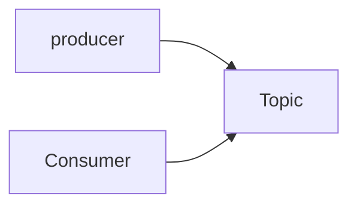

# coupon-system
실습으로 배우는 선착순 이벤트 시스템


## 1. 요구사항 정의
선착순 100명에게 할인쿠폰을 제공하는 이벤트를 진행하고자 한다.

이 이벤트는 아래와 같은 조건을 만족하여야 한다.
- 선착순 100명에게만 지급되어야한다.
- 101개 이상이 지급되면 안된다.
- 순간적으로 몰리는 트래픽을 버틸 수 있어야 합니다.


## 2. 문제점

### race condition 
- 두 개 이상의 쓰레드가 공유 데이터에 엑세스하고 작업하려고 할 때 발생하는 문제

### 예상 동작

|Thread-1|Coupon count|Thread-2|
|--|--|--|
|select count(*) from coupon|99| |
|create coupon|100| |
| | 100 | select count(*) from coupon|
| | 100 | failed create coupon|

### 실제 동작

|Thread-1|Coupon count|Thread-2|
|--|--|--|
|select count(*) from coupon | 99 | |
| | 99 | select count(*) from coupon |
| create coupon | 100 | |
| | 101 | create coupon |


## 3. Redis를 활용하여 문제 해결하기

## 4. Kafka를 활용하여 문제 해결하기 
### 카프카란?
- 분산 이벤트 스트리밍 플랫폼
- 이벤트 스트리밍이란 소스에서 목적지까지 이벤트를 실시간으로 스트리밍하는 것




- 토픽 생성

```
docker exec -it kafka kafka-topics.sh --bootstrap-server localhost:9092 --create --topic testTopic
```

- 프로듀서 실행
```
docker exec -it kafka kafka-console-producer.sh --topic testTopic --broker-list 0.0.0.0:9092
```


- 컨슈머 실행 
```
docker exec -it kafka kafka-console-consumer.sh --topic testTopic --bootstrap-server localhost:9092
```

- 프로듀서를 활용하여 쿠폰을 생성할 유저의 아이디를 토픽에 넣고 컨슈머를 활용하여 유저 아이디를 가져와서 쿠폰을 생성

## 5. 요구사항 변경

## 6. 시스템 개선하기